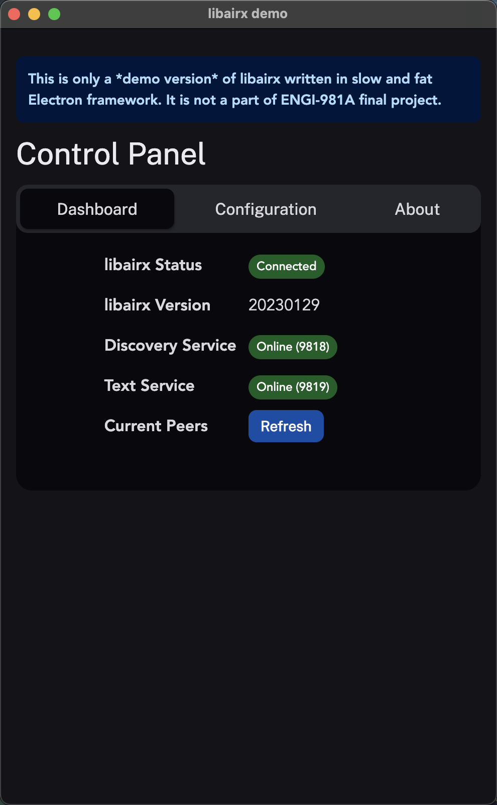

## libairx - AirX Core Library

[](https://github.com/hatsune-miku/libairx/actions/workflows/rust.yml)

[接口文档](https://github.com/hatsune-miku/libairx/wiki)

### Features

- LAN Discovery
- Text sync over LAN (TCP)

### WIP

- Text sync over Internet (TCP)
- File sharing over LAN (TCP)
- File sharing over Internet (Upload & share link)

### Usage

- Build

```shell
cargo build --release --lib
```

### Demonstration

[demoairx](https://github.com/hatsune-miku/demoairx): Demo build written in Electron + FFI.


### Credits

| Contributor |     #     |
|:-----------:|:---------:|
|    G, Z     | 202191382 |
|    L, S     | 201714987 |
|    G, J     | 202096888 |
|    G, C     | 202194431 |
